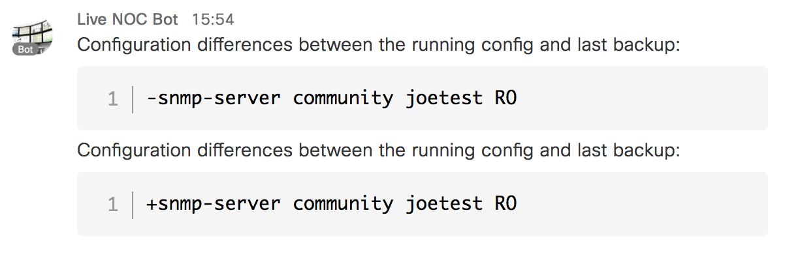
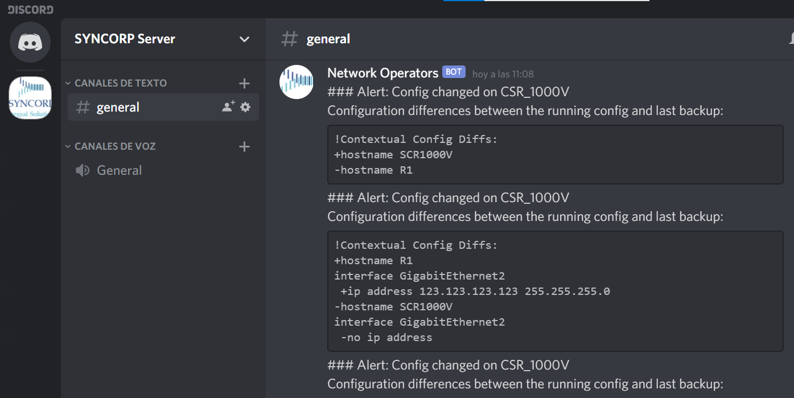

# EEM: Config Diff to Discord

An EEM+Python policy that pushes config change diffs to Discord.



## Setup

First, request a webhook in Discord. You can follow intruction "MAKING A WEBHOOK" here:
https://support.discord.com/hc/en-us/articles/228383668-Intro-to-Webhooks

You will have a link like  this:
https://discordapp.com/api/webhooks/YOUR_DISCORD_INFO_1/YOUR_DISCORD_INFO_2

Take info "YOUR_DISCORD_INFO_1/YOUR_DISCORD_INFO_2". This will be your identification to call your webhook on your Cisco device. It will be used later as a variable called discord_token.

This script requires the IOS-XE _guestshell_ feature.  To enable guestshell, configure:

   ```
   iox
   ```

Then activate a VirtualPort Group0 with an IP Address. This example will use  ip unnumbered instead of an fixed ip address. This give you the ability to assign an IP Address to our Linux container an IP address in the same network as the outside interface.


   ```
   interface VirtualPortGroup0
   ip unnumbered [INTERFACE_TO_INTERNET_ACCESS]

   app-hosting appid guestshell
   vnic gateway1 virtualportgroup 0 guest-interface 0 guest-ipaddress [IP_ADDRESS_RANGE_NETWORK_OF_VirtualPortGroup_0] netmask [NETMASK_GI1_RANGE_NETWORK_OF_VirtualPortGroup_0] gateway [IP_GATEWAY_GI1_RANGE_NETWORK_OF_VirtualPortGroup_0] name-server 8.8.8.8
   ```

   Example:
   ```
!   
   interface GigabitEthernet1
    ip address 192.168.1.2 255.255.255.0
    description WITH_CONNECTION_TO_INTERNET
!
   interface VirtualPortGroup0
    ip unnumbered GigabitEthernet1
!
   app-hosting appid guestshell
    vnic gateway1 virtualportgroup 0 guest-interface 0 guest-ipaddress 192.168.1.3 netmask 255.255.255.0 gateway 192.168.1.1 name-server 8.8.8.8

   ```

**Note:** You can configure it at normally is explained by Cisco webpage with NAT, ACL and isolated IP Address, but it's more easy to have direct access to the linux container. In case you want it to do it in the classic way here it is the link: "https://www.cisco.com/c/en/us/td/docs/ios-xml/ios/prog/configuration/166/b_166_programmability_cg/guest_shell.html" or "https://developer.cisco.com/learning/lab/intro-guestshell/step/1"


Establish connection to internet and add a route to your Linux container. If your device has already connection to internet you can avoid the default route mentioned here:

   ```
   ip route 0.0.0.0 0.0.0.0 192.168.1.1
   ip route 192.168.1.3 255.255.255.255 VirtualPortGroup0
   ```

Then type the following in `EXEC` mode:

   ```
   guestshell enable
   ```

Guestshell may not include the needed `requests` module.  Enter guestshell with the following command:

   ```
   guestshell
   ```

From the guestshell prompt, run the following command:

   ```
   sudo pip install requests
   ```

If this returns an error about not being able to establish a connection to download the module, you
may need to update your DNS settings within guestshell.  If you know your DNS server, you can use
that address.  If you don't, just use 8.8.8.8.  Run the command:

   ```
   sudo echo 'nameserver DNSSERVER' > /etc/resolv.conf
   ```

Where DNSSERVER is the IP address of your DNS server (or 8.8.8.8).  After doing that, repeat
the `pip` command, and it should install successfully.  If `pip` tells you `requests` is already
installed, then your guestshell environment is good.  You can type `exit` to return to IOS-XE.

**NOTE** The guestshell environment will persist across reboots.  It will not revert to the default
state unless you do a `guestshell destroy` followed by another `guestshell enable`.

Next, define the following EEM environment. Be sure **NOT** to put quotes around the variable
values:

* `discord_token` : Webhook token for your Discord user/bot
* `discord_room`  : discord username to which appears in the messages will be sent

    ```
    event manager environment discord_token 1234abd.../1234abd...
    event manager environment discord_room Network Operators
    event manager environment device_name CSR_1000V
    ```
Once the environment variables have been defined, copy the script to the EEM user policy
directory.  If you have not defined an EEM user policy directory yet, a good choice is
to use the share directory called `bootflash:/guest-share` in which to store EEM policies.  Once
the directory has been selected, configure:

   ```
   event manager directory user policy bootflash:/guest-share
   ```

Once your policy has been copied into that directory, register it with the following
command:

   ```
   event manager policy sl_config_diff_to_discord.py
   ```

Once configuration changes start to happen, check your specified Discord channel Webhook for updates.

Example of response:

